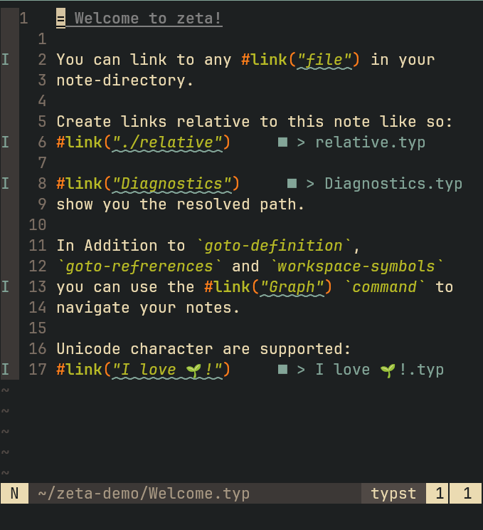
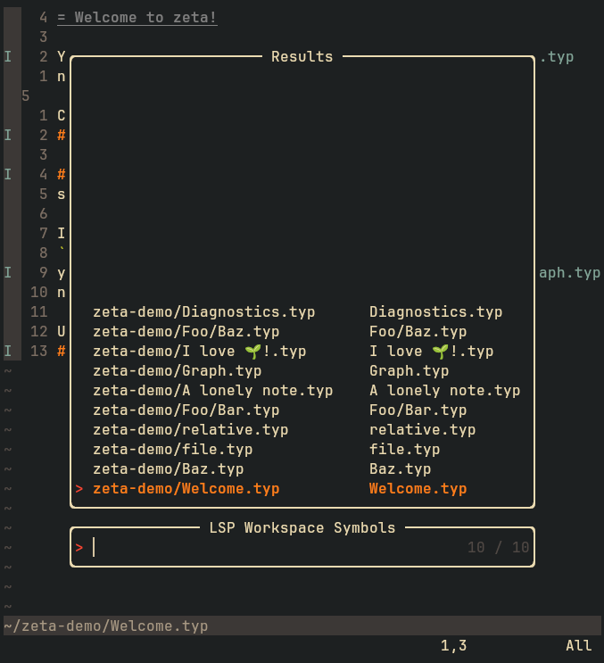

# zeta $\zeta$

A highly performant language server for __zettelkasten__-style note-taking in __typst__ that provides real-time reference tracking and navigation.

<p style="display: flex; justify-content: space-between; margin: 0;">
  
  
  
</p>

## Highlights

- **Perfomant**: Uses incremental parsing and concurrent processing for real-time updates
- **Consistant**: Seemless in-background cache validation ensures consitency
- **Configurable**: Uses tree-sitter for robust reference parsing with configurable queries
- **Efficient**: SQLite-based persistent cache for fast startup and reference lookups
- **Integrated**: Maintains a Hayagriva bibliography of all notes for easy integration with typst

## Language Server Features

1. **Go to Definition**: Navigate directly to referenced notes
2. **Find References**: Locate all notes that reference the current note
3. **Document Diagnostics**: Real-time hints on references

## Installation
Download the latest release or build from source with
```bash
git clone git@github.com:lentilus/zeta.git && cd zeta
go build ./cmd/zeta -o zeta
```
Now place the binary somewhere in neovims runtime path and make sure it is executable.

## Configuration
You can configure zeta for use with neovim using lspconfig.
__If you know what you are doing you can of course configure the lsp without lspconfig.__

We must first register the zeta as a language server.
```lua
local configs = require("lspconfig.configs")

if not configs.zeta then
  configs.zeta = {
    -- Here we define the default configuration
    default_config = {
      cmd = { "zeta" },
      filetypes = { "typst" },
      root_dir = function(fname)
        return lspconfig.util.root_pattern(".zeta")(fname) or nil
      end,
      init_options = {
        reference_query = "(ref) @reference",
        target_regex = "^@(.*)$",
        path_separator = ":",
        canonical_extension = ".typ",
      },
    },
  }
end
```

Afterwards we can configure zeta like any other lsp.
```lua
local lspconfig = require("lspconfig")
lspconfig.zeta.setup({
  on_attach = function(client, bufnr)
    print("zeta attached!")
  end,
})
```
