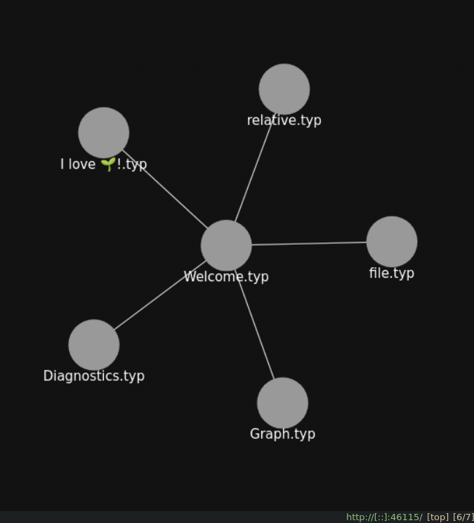

# zeta $\zeta$

A typst language-server for __zettelkasten__-style note-taking with reference tracking and navigation.

<p style="display: flex; justify-content: space-between; margin: 0;">
  
  
  
</p>

## Language Server Features
1. **Go to Definition** navigates directly to referenced notes.
2. **Find References** locates all notes that reference the current note (backlinks).
3. **Workspace Symbols** show all notes by name and path. __(Best used with Telescope)__
4. **Document Diagnostics** hint a links resolved path.

## Installation
Download the latest release or build from source with
```bash
git clone git@github.com:lentilus/zeta.git
cd zeta && nix build .#zeta
```
> Make sure to place the binary is executable and in neovims runtime path!

## Configuration
Take a look at `_example/init.lua` for how to setup zeta.

## Planned
- [ ] more documentation for usage and setup
- [ ] `zeta --dump` dumps the note-graph as yaml
- [ ] prettier graph view
